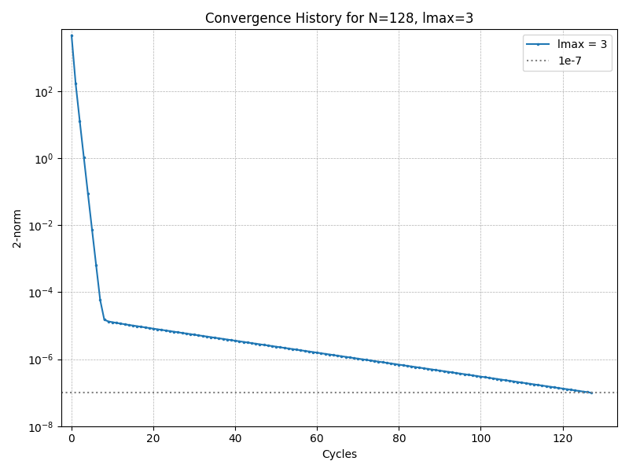
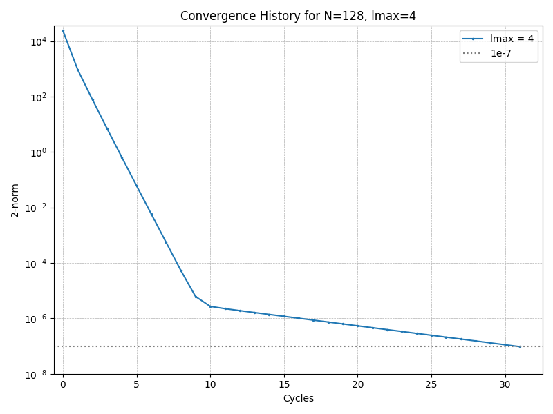
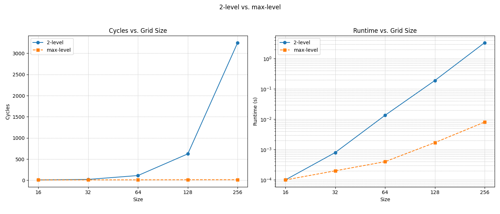

# mg: A Multigrid Solver for the Poisson Equation <!-- omit from toc -->

This document outlines the structure, compilation, execution, and implementation details for the multigrid solver for the Poisson equation.

- [Folder Structure](#folder-structure)
- [How to Compile and Run](#how-to-compile-and-run)
- [Code Explanation](#code-explanation)
  - [smooth Function](#smooth-function)
  - [residual Function](#residual-function)
  - [restriction Function](#restriction-function)
  - [prolongate Function](#prolongate-function)
  - [gauss Function](#gauss-function)
  - [vcycle Function](#vcycle-function)
- [Figure Explanations](#figure-explanations)
  - [Performance vs. lmax](#performance-vs-lmax)
  - [lmax Residual Histories](#lmax-residual-histories)
  - [Performance Difference for Different Multigrid Strategies](#performance-difference-for-different-multigrid-strategies)

## Folder Structure

The project is organized as follows:

```
mg/
├── .vscode/                   // Any files pertaining to VS Code
│   └── settings.json
├── data/                      // Contains data after running the programs
│   ├── comparison.csv
│   ├── residuals.csv
│   └── summary.csv
├── figs/                      // Contains figures
│   ├── q1_perf-vs-lmax.png
│   ├── q1_residuals-lmax2.png
│   ├── q1_residuals-lmax3.png
│   ├── q1_residuals-lmax4.png
│   ├── q1_residuals-lmax5.png
│   ├── q1_residuals-lmax6.png
│   ├── q1_residuals-lmax7.png
│   └── q2_comparison.png
├── include/                   // Header files for...
│   ├── common.h               // common things between the first and second question,
│   └── multigrid.h            // and multigrid-specific functions
├── scripts/
│   └── plot.py
│── src/                       // All source files for...
│   ├── common/                // the multigrid-specific functions,
│   │   └── multigrid.c
│   ├── q1/                    // the main driver for the first question,
│   │   └── main.c
│   └── q2/                    // and the main driver for the second question
│       └── main.c
├── .clang-format
├── .editorconfig
├── Makefile
├── README.md
└── requirements.txt
```

A more detailed description of top-level files and folders follows:

- data/: Contains CSV files with timing information, residual values, and comparison data from different multigrid configurations.
- figs/: Contains generated plots showing convergence behavior and performance metrics of the multigrid method.
- include/: Contains header files defining data structures and function prototypes for the multigrid implementation.
- scripts/: Contains a Python script for the visualization of results.
- src/: Contains all source code files organized by functionality and specific tasks.s
- README.md: This report file.

## How to Compile and Run

1. **Prerequisites**:

   - A C/C++ compiler (e.g., GCC or G++).
   - Python packages as given in requirements.txt. Can be installed by running (within the root directory):

      ```bash
      pip install -r requirements.txt
      ```

2.  **Compile**:

    - Run the make command within the root directory. This will compile the C source files and create two executables - the first is q1 in bin/, and the second is q2 also in bin/, both of which are for answering the first and second question, respectively.

3.  **Run**:

    - Execute the compiled programs from the terminal using make run; this will run both programs and also carry out the plotting. This will generate the required plots in the figs/ directory.

## Code Explanation

We explain how our implementation follows the pseudocode given while also explaining the intricacies of the programs.

### smooth Function

The smooth function implements the weighted Jacobi relaxation method for smoothing high-frequency error components. It is a crucial part of the multigrid algorithm as it effectively reduces high-frequency errors while being computationally inexpensive.

The implementation performs omega iterations of the weighted Jacobi method, which works as follows:

1. For each iteration, the current solution x is first copied to a temporary array, named temp, to ensure the updates don't affect other calculations within the same iteration.
2. For each interior point, we calculate a new value as the weighted average of its four neighbors plus a scaled contribution from the right-hand side.
3. The new value is then combined with the old value using the relaxation parameter omega to form the updated solution:

    ```c
    // Update interior points using a weighted average
    for (int i = 1; i < n - 1; i++) {
      for (int j = 1; j < n - 1; j++) {
        double new = 0.25 * (temp[i - 1][j] + temp[i + 1][j] + temp[i][j - 1] +
                             temp[i][j + 1] + h2 * b[i][j]);
        x[i][j]    = (1.0 - omega) * temp[i][j] + omega * new;
    ```

    The relaxation parameter omega is crucial for convergence. In our implementation, we use omega=2/3 (as can be seen in src/q1/main.c and src/q2/main.c).

### residual Function

The residual function computes the residual vector r=b-Ax and its 2-norm, which serves as our measure of convergence. For the Poisson equation, where A represents the discrete Laplacian operator, the residual calculation involves:

1. For each interior point, computing the discrete Laplacian of the current solution x.
2. Subtracting this from the right-hand side b to get the residual at that point.
3. Computing the sum of squared residuals and taking its square root to get the 2-norm.

The residual norm provides a quantitative measure of how close our current solution is to the true solution of the linear system. In our implementation, this norm is used to determine when to stop the iteration process.

### restriction Function

The restriction function transfers the residual from a fine grid to a coarser grid. We implement full-weighting restriction.

The full-weighting stencil uses a weighted average with the following weights:

```math
\begin{bmatrix}1/16&1/8&1/16\\1/8&1/4&1/8\\1/16&1/8&1/16\end{bmatrix}
```

This means that for each coarse grid point $(i,j)$, its value is a weighted average of nine points from the fine grid centered around $(2i,2j)$. The center point gets a weight of 1/4, the adjacent points (horizontally and vertically) get weights of 1/8, and the diagonal points get weights of 1/16.

### prolongate Function

The prolongate function transfers a correction from a coarse grid to a fine grid using bilinear interpolation. This operation is the transpose of the restriction operation and is essential for propagating corrections computed on coarser grids back to finer grids.

The implementation follows these steps:

1. Copy the coarse grid values to coincident fine grid points (where both coarse and fine grids have points).
2. Interpolate horizontally for fine grid points that lie between coarse grid points horizontally.
3. Interpolate vertically for fine grid points that lie between coarse grid points vertically.
4. Interpolate diagonally for fine grid points that lie in the center of four coarse grid points.

This approach ensures smooth interpolation of corrections, which is critical for maintaining the accuracy of the multigrid method.

### gauss Function

The gauss function implements the Gauss-Seidel iterative method to solve the linear system on the coarsest grid. On this level, direct solution or a highly converged iterative solution is needed since errors on the coarsest grid affect all finer grids.

The implementation:

1. Initializes the solution array to zero.
2. Iteratively updates each interior point using the most recent values of neighboring points.
3. Continues until either convergence is reached (maximum change in any point less than a tolerance) or a maximum number of iterations is reached.

Using Gauss-Seidel at the coarsest level is efficient because:

- The coarsest grid is small, making even many iterations relatively inexpensive.
- Gauss-Seidel converges faster than Jacobi and is more stable.
- The method naturally handles the boundary conditions imposed by the problem.

### vcycle Function

The vcycle function is the core of the multigrid method, implementing the recursive algorithm as described in the assignment. It follows these steps:

1. Apply pre-smoothing to the current solution (using weighted Jacobi).
2. Compute the residual of the current solution.
3. If at the coarsest level:

   - Solve the residual equation directly using Gauss-Seidel.
   - Add the correction to the current solution.

    Otherwise:

   - Restrict the residual to the coarser grid.
   - Recursively call vcycle on the coarser grid to get a correction.
   - Prolongate the correction back to the current grid and add it to the solution.

4. Apply post-smoothing to the updated solution.

This implementation closely follows the pseudocode provided in the assignment, with appropriate adaptations for our data structures and boundary conditions.

The recursion continues until reaching the coarsest level, where we solve exactly using Gauss-Seidel. After computing corrections on each level, we propagate them back up through the grid hierarchy, applying smoothing at each step to eliminate new high-frequency errors introduced by the interpolation.

## Figure Explanations

### Performance vs. lmax


This figure shows how the performance of the multigrid solver varies with the number of levels (lmax) for a fixed grid size of N=128. It consists of two plots:

- **Cycles vs. Levels**: This plot demonstrates how the number of cycles required to reach the target residual decreases dramatically as more grid levels are used. With lmax=2, the solver requires over 600 cycles, but this drops to around 127 cycles with lmax=3 and continues to decrease to approximately 15 cycles with lmax=7. The most significant improvement occurs when moving from two to three levels, illustrating the power of the multilevel approach.
- **Runtime vs. Levels**: This plot shows the actual computation time needed to reach convergence. The runtime improves from approximately 0.19 seconds with a 2-level method to around 0.003 seconds with a 5-level or higher configuration. While the runtime curve follows the cycles curve, it also accounts for the overhead of managing multiple grid levels.

Both plots demonstrate that while a 2-level approach works, it requires significantly more cycles and time than a true multigrid approach with three or more levels. For N=128, the optimal configuration appears to be five or six levels, where further increases in the number of levels provide diminishing returns.

### lmax Residual Histories

<p float="left">
  
  
</p>

For lmax=2, we observe a slow, nearly linear convergence requiring about 600 cycles to reach the target residual (dotted line). There's an initial sharp drop followed by much slower convergence.

For lmax=3, convergence is much faster, requiring only about 127 cycles. While still showing an initial drop followed by slower convergence, the overall slope is steeper, indicating more efficient error reduction per cycle.

<p float="left">
  
  
</p>

With lmax=4, convergence accelerates further, requiring only about 31 cycles. The plot shows a very sharp initial drop in residual, followed by a more gradual convergence to the target.

The lmax=5 configuration converges in just 14 cycles. The convergence is nearly linear on the log scale, indicating a consistent reduction factor in the error at each cycle, which is a characteristic of an optimal multigrid implementation.

<p float="left">
  
  
</p>

The lmax=6 plot shows similar behavior to lmax=5, converging in about 13 cycles with a nearly linear reduction in the residual on the log scale.

Interestingly, lmax=7 takes slightly more cycles (about 15) than lmax=6, despite having more levels. The initial residual is higher than in other configurations, but the convergence rate remains excellent with a consistent slope on the log scale.

These plots visually demonstrate that the convergence rate of multigrid methods can be made nearly independent of the grid size with proper implementation.

### Performance Difference for Different Multigrid Strategies



The comparison includes:

- **Cycles vs. Grid Size**: The 2-level method shows dramatic growth in required cycles as the grid size increases, from eight cycles at N=16 to over 3200 cycles at N=256. In stark contrast, the max-level approach maintains a nearly constant cycle count (between eight to 13 cycles) regardless of grid size, demonstrating the grid-size independence of properly implemented multigrid methods.
- **Runtime vs. Grid Size**: Shown on a logarithmic scale, this plot highlights the computational efficiency difference. At N=256, the max-level method is approximately 350 times faster than the 2-level method. The 2-level method exhibits worse than O(N^2) scaling, while the max-level approach maintains much closer to O(NlogN) scaling.

This comparison clearly demonstrates the superior scalability of the full multigrid approach.
